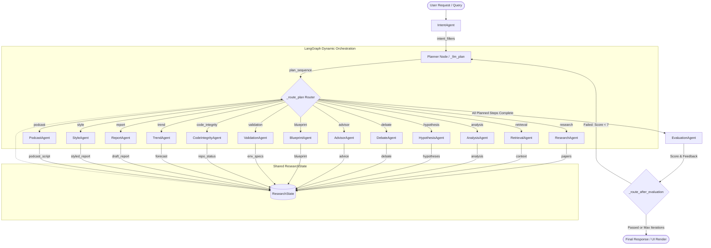
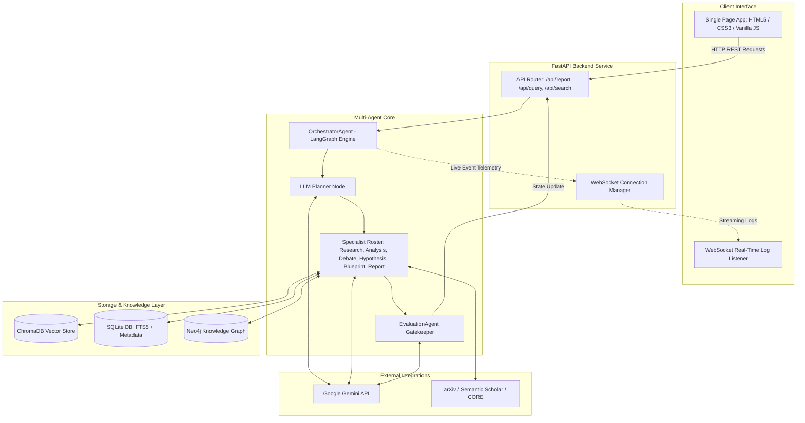

# A.I.R.A. — Agentic Intelligence & Research Assistant

> **An autonomous multi-agent research intelligence platform powered by 17+ specialized AI agents, dynamic LangGraph orchestration, and Agentic RAG.**

[](https://www.python.org/downloads/)
[](https://fastapi.tiangolo.com)
[](https://langchain-ai.github.io/langgraph/)
[](https://ai.google.dev/)
[](https://www.trychroma.com/)
[](LICENSE)

---

## 🚀 Overview

Modern academic literature grows at an exponential rate, with thousands of preprints published daily across arXiv, bioRxiv, and IEEE. Conventional generative AI applications treat research discovery either as a simple chat interaction or as standard single-turn Retrieval-Augmented Generation (RAG). 

**A.I.R.A. (Agentic Intelligence & Research Assistant)** fundamentally departs from shallow chatbots. It is an **autonomous, stateful multi-agent system** designed to automate the complete academic research lifecycle—from multi-database literature discovery and semantic chunk extraction to adversarial debate, hypothesis generation, reproducible code blueprinting, and publication-grade literature synthesis.

By coordinating **17+ specialized AI agents** over a shared, typed research state, A.I.R.A. performs deep multi-hop reasoning and continuous reflective evaluation, transforming raw academic preprints into rigorous, structured scientific intelligence.

---

## 🎯 Problem

The manual academic research process is fragmented, high-friction, and cognitively overwhelming:
1. **Discovery Bottleneck**: Researchers must manually query disparate databases (arXiv, Semantic Scholar, CORE, OpenAlex) and sift through hundreds of search results.
2. **Context Fragmentation**: Conventional RAG systems retrieve top-k isolated text chunks, missing multi-document structural relationships, contradictory findings, and longitudinal research trajectories.
3. **Lack of Critical Stress-Testing**: Standard LLM generation accepts retrieved text at face value without validating methodologies, detecting dataset biases, or formulating counter-hypotheses.
4. **Reproducibility Gap**: Translating paper methodologies into concrete executable code or environments requires manual, error-prone reverse engineering.
5. **Synthesis Overhead**: Drafting publication-ready literature reviews with accurate bibliometrics, categorized findings, and formal citation structures takes weeks of manual effort.

---

## 💡 Solution

A.I.R.A. automates this lifecycle by deploying specialized autonomous agents arranged in a dynamic state graph:
- **Autonomous Query Decomposition**: Deconstructs ambiguous topics into structured academic filters (temporal bounds, field taxonomy, publication sources).
- **Adaptive Graph Planning**: Dynamically selects and orders specialist agents based on query complexity rather than executing a rigid, linear script.
- **Dialectic & Speculative Reasoning**: Pits opposing viewpoints (Optimist vs. Skeptic) against evidence and generates testable cross-domain hypotheses.
- **Engineering Blueprinting**: Automatically translates theoretical paper equations and architectures into structured Python skeletons and containerized environment manifests.
- **Closed-Loop Evaluation**: Evaluates draft quality using structured rubrics (1–10 scoring) and triggers corrective replanning loops when criteria are unmet.

---

## 🤖 17+ Specialized AI Agents

A.I.R.A. incorporates 17+ purpose-built agents and core components, categorized by their operational domain and reachability:

| Agent / Component | Primary Responsibility | LLM / Provider | Execution & Reachability |
| :--- | :--- | :--- | :--- |
| **BaseAgent** | Core foundation providing logging, execution safety wrappers, and SSE/WebSocket telemetry. | N/A (Utility) | Active Base Class |
| **OrchestratorAgent** | StateGraph controller compiling the execution graph, managing memory transitions, and routing nodes. | N/A (Controller) | 100% Active (Graph Manager) |
| **Planner Capability** | Generates dynamic workflow plans (`PlannerOutput`) with explicit rationale based on intent and task. | Gemini 2.0/3.6 Flash | 100% Active (Initial Planning Node) |
| **IntentAgent** | Deconstructs natural language queries into structured academic filters (year range, primary sources, taxonomy). | Gemini Flash / Deterministic | 100% Active (Entrypoint Node) |
| **ResearchAgent** | Dispatches concurrent API queries to arXiv, Semantic Scholar, CORE, downloads PDFs, and extracts text. | N/A (Tools / APIs) | Conditionally Executed (Discovery Stage) |
| **RetrievalAgent** | Semantic search engine querying ChromaDB collections for granular chunk-level evidence. | N/A (ChromaDB / SQLite) | Conditionally Executed (Context Stage) |
| **AnalysisAgent** | Multi-document insight extractor synthesizing methodology breakdowns, findings, and empirical limits. | Gemini Flash | Conditionally Executed (Evidence Stage) |
| **HypothesisAgent** | Formulates novel, testable cross-domain scientific hypotheses based on identified gaps and future work. | Gemini Flash | Conditionally Executed (Exploration Stage) |
| **DebateAgent** | Simulates adversarial peer review contrasting Optimist vs. Skeptic perspectives to stress-test claims. | Gemini Flash | Conditionally Executed (Critique Stage) |
| **AdvisorAgent** | Strategic research advisor identifying unexplored research gaps and recommending structured roadmaps. | Gemini Flash (RAG) | Conditionally Executed (Advisory Stage) |
| **TrendAgent** | Bibliometric analyzer forecasting topic velocity, 3-year impact probabilities, and emerging keywords. | Gemini Flash | Conditionally Executed (Forecasting Stage) |
| **BlueprintAgent** | Method-to-code translator converting theoretical paper architectures into modular Python skeletons. | Gemini Flash | Conditionally Executed (Implementation Stage) |
| **ValidationAgent** | Environment containerization service generating Dockerfiles and `requirements.txt` manifests. | Gemini Flash | Conditionally Executed (Validation Stage) |
| **CodeIntegrityAgent** | Verifies open-source repository authenticity and links papers to official GitHub/GitLab repositories. | Gemini Flash / Mock Check | Conditionally Executed (Code Verification) |
| **ReportAgent** | Scholarly literature review synthesizer integrating all upstream specialist findings and formal citations. | Gemini Flash | 100% Active (Synthesis Stage) |
| **ReviewerAgent** | Inline self-critique mechanism performing revision passes on draft reports prior to finalization. | Gemini Flash | Conditionally Executed (Internal to Report) |
| **StyleAgent** | Multi-persona adapter restyling reports for target audiences (Academic, Beginner, Executive, Blog). | Gemini Flash / Pass-through | Conditionally Executed (Styling Stage) |
| **PodcastAgent** | Scriptwriter converting technical research reports into natural 2-host conversational audio scripts. | Gemini Flash | Conditionally Executed (Dissemination Stage) |
| **EvaluationAgent** | Strict academic gatekeeper scoring outputs (1–10) and driving reflection/replanning loops. | Gemini Flash (Structured) | 100% Active (Terminal Verification Node) |

---

## 🧠 Agentic Architecture



---

## 🔎 Agentic RAG

A.I.R.A. replaces naive single-shot RAG with an **evidence-routing Agentic RAG pipeline**:

1. **Multi-Source Collection**: Academic paper discovery queries arXiv, Semantic Scholar, CORE, and OpenAlex.
2. **Document Ingestion & Chunking**: PDFs are downloaded and parsed via PyMuPDF using recursive token-aware character splitting with configurable sliding-window overlap (`chunk_size=600`, `chunk_overlap=50`).
3. **Hybrid Vector & Lexical Indexing**: Document embeddings and chunk texts are stored in a persistent ChromaDB database, complemented by SQLite Full-Text Search (FTS5 / BM25) for high-precision keyword recall without native runtime deadlocks.
4. **Context Enrichment**: Retrieved chunks are enriched with metadata (authors, publication dates, venue, citation metrics, source URLs) before injection into downstream specialist reasoning prompts.

---

## 🔄 Orchestration

A.I.R.A.'s orchestration is managed via **LangGraph** with a strongly-typed `ResearchState` dictionary containing 21 state fields:

```python
class ResearchState(TypedDict):
    query: str
    action: str
    task: dict
    intent_filters: dict
    plan: list[dict]
    plan_rationale: str
    current_step: int
    agent_outputs: dict
    agent_errors: dict
    shared_memory: list[dict]
    research_results: list[dict]
    retrieval_context: str
    hypotheses: str
    analysis_results: str
    advice_output: str
    debate_output: str
    code_integrity_results: list[dict]
    blueprint_output: str
    trend_output: str
    validation_output: str
    draft_report: str
    styled_report: str
    podcast_script: str
    final_output: str
    sources: list[dict]
    evaluation_feedback: str
    evaluation_score: int
    evaluation_passed: bool
    iterations: int
    next_agent: str
    workflow_error: bool
```

### Dynamic Routing & Reflection
- **Upfront Planning**: The Planner LLM evaluates query complexity and selects an ordered list of specialist steps (`plan`).
- **Sequential Step Execution**: The `_route_plan` conditional router executes the selected agents sequentially, updating `ResearchState` after each step.
- **Terminal Reflection Loop**: The `EvaluationAgent` assesses the final synthesized output against a strict academic rubric. If the score is below threshold (`score < 7`) and reflection limits are not exceeded (`iterations < 3`), the state machine loops back to the Planner for corrective replanning with explicit feedback.

---

## 📚 Research Synthesis

During the synthesis stage, `ReportAgent` aggregates intermediate intelligence across multiple state fields into a cohesive scholarly literature review structured as follows:

- **Executive Summary**: High-level problem context and core contributions.
- **Methodological Landscape**: In-depth comparative analysis of approaches, algorithmic frameworks, and experimental paradigms across ingested preprints.
- **Critical Dialectic & Limitations**: Integrated synthesis of adversarial critique (DebateAgent) highlighting dataset biases, benchmark oversights, and theoretical boundaries.
- **Future Horizons & Hypotheses**: Testable open research questions and cross-domain hypotheses (HypothesisAgent).
- **Implementation & Reproducibility**: Practical engineering considerations and code availability (CodeIntegrityAgent & BlueprintAgent).
- **Comprehensive Bibliography**: Formatted academic references with verified author lists, venues, and DOI/arXiv hyperlinks.

---

## 📊 Evaluation & Validation

A.I.R.A. enforces automated quality control at the output stage:
- **EvaluationAgent**: Implements structured Pydantic schema validation (`EvaluationOutput`) scoring completeness, academic tone, logical coherence, and relevance on a scale of 1–10.
- **ValidationService**: Validates generated code blueprints by constructing minimal, reproducible container specifications (Dockerfiles, dependency files, and build commands).
- **Budget & Quota Tracking**: Thread-safe telemetry tracking (`CallBudgetTracker`) monitors API calls and prevents cascade execution failures.

---

## 🛠️ Technology Stack

| Category | Technologies |
| :--- | :--- |
| **AI / LLMs** | Google Gemini (`gemini-2.0-flash`, `gemini-3.6-flash`), LangChain, Pydantic Structured Outputs |
| **Agent Framework** | LangGraph (StateGraph, Conditional Edges, Reflection Loops) |
| **Backend & WebSockets** | FastAPI, Uvicorn, AsyncIO, Starlette WebSockets |
| **Retrieval & Search** | ChromaDB (Vector Index), SQLite FTS5 (BM25 Full-Text Search), NumPy |
| **Database & Knowledge Graph** | Neo4j (`neo4j-driver`), SQLite3 |
| **Academic APIs** | arXiv API, Semantic Scholar API, CORE API, OpenAlex API |
| **Data Engineering** | PyMuPDF (PDF Extraction), Scikit-Learn (PCA 3D Visualization) |
| **Frontend** | Modern Vanilla JavaScript (ES6+), CSS3 Glassmorphism, Vis.js, Plotly.js, FontAwesome |
| **Infrastructure & CI** | Docker, Docker-Compose, n8n Automation Workflows |

---

## 🏗️ System Architecture



---

## 📈 Project Metrics

- **17+ Specialized AI Agents & Components**
- **552 Pre-indexed Vector Chunks** in local ChromaDB knowledge storage
- **4 Academic Database Clients** (arXiv, Semantic Scholar, CORE, OpenAlex)
- **18 REST API Endpoints & Webhooks** + 1 Real-time WebSocket Telemetry Channel
- **21 Typed State Fields** in LangGraph `ResearchState`
- **4 Rich Interactive Views** in Frontend UI (Deep Search, Neural Chat, Synthesize, 3D Graph & Trend Analytics)

---

## 🎥 Demo

> **Live Demo Recording**: *[Demo Video Link Placeholder — Razorpay Hackathon / Internship Pitch]*

---

## ⚙️ Installation

### Prerequisites
- Python 3.10 or higher
- Git
- Google Gemini API Key ([Get a free key here](https://aistudio.google.com/))

### Setup Instructions

1. **Clone the Repository**:
   ```bash
   git clone https://github.com/VishnuKondaveeti/agentic-research-matrix.git
   cd Prototype-1
   ```

2. **Create and Activate Virtual Environment**:
   ```bash
   # Windows (PowerShell)
   python -m venv .venv
   .\.venv\Scripts\Activate.ps1

   # Linux / macOS
   python3 -m venv .venv
   source .venv/bin/activate
   ```

3. **Install Dependencies**:
   ```bash
   pip install -r requirements.txt
   ```

4. **Configure Environment Variables**:
   Create a `.env` file in the project root:
   ```env
   PYTHONPATH=.
   GOOGLE_API_KEY=your_gemini_api_key_here
   LLM_PROVIDER=gemini
   LLM_MODEL=gemini-2.0-flash
   CHROMA_PERSIST_DIR=C:/AIData/research_chroma
   API_HOST=127.0.0.1
   API_PORT=8000
   DEMO_GEMINI_ONLY=true
   ```

---

## ▶️ Running the Application

Start the FastAPI application with Uvicorn:

```bash
python -m uvicorn api.main:app --host 127.0.0.1 --port 8000 --reload
```

- **Dashboard UI**: [http://127.0.0.1:8000](http://127.0.0.1:8000)
- **Interactive Swagger Documentation**: [http://127.0.0.1:8000/docs](http://127.0.0.1:8000/docs)
- **ReDoc API Spec**: [http://127.0.0.1:8000/redoc](http://127.0.0.1:8000/redoc)

---

## 🔌 API

| Endpoint | Method | Description |
| :--- | :--- | :--- |
| `/api/health` | `GET` | Lightweight health check reporting system status and document counts. |
| `/api/search` | `POST` | Triggers multi-database paper discovery and ingestion. |
| `/api/query` | `POST` | Neural Chat endpoint executing Agentic RAG Q&A over the knowledge base. |
| `/api/report` | `POST` | Core Synthesize endpoint executing the full multi-agent literature review cascade. |
| `/api/papers` | `GET` | Lists all ingested metadata files and vector collection stats. |
| `/api/ingest` | `POST` | Triggers background PDF processing and vector database indexing. |
| `/api/analyze` | `POST` | Runs deep multi-paper technical insight extraction. |
| `/api/advise` | `POST` | Generates strategic research roadmap advice and unexplored gap detection. |
| `/api/trends` | `GET` | Fetches temporal research trend metrics and keyword clusters. |
| `/api/trends/{topic}` | `GET` | Fetches topic-specific momentum and velocity forecasts. |
| `/api/analytics/leaderboard` | `GET` | Returns researcher/paper impact rankings and bibliometrics. |
| `/api/analytics/graph` | `GET` | Returns graph node and edge topology for D3/Vis.js visualization. |
| `/api/analytics/embeddings` | `GET` | Returns 3D PCA dimensional reduction points for vector visualization. |
| `/api/upload` | `POST` | Accepts direct PDF file uploads for processing into vector storage. |
| `/api/info` | `GET` | Returns platform capabilities and metadata. |
| `/api/ws/logs` | `WebSocket` | Real-time bi-directional log stream for live agent telemetry. |
| `/webhook/new-topic` | `POST` | Webhook trigger for automated n8n research topic discovery. |
| `/webhook/ingest` | `POST` | Webhook trigger for automated paper batch ingestion. |
| `/webhook/report` | `POST` | Webhook trigger for scheduled automated synthesis report generation. |

---

## 🧪 Testing & Validation

Run isolated component tests and syntax validation:

```bash
# Verify Python compilation across all agent and RAG files
python -m py_compile agents/*.py rag/*.py api/*.py config/*.py

# Verify VectorStore retrieval and health diagnostics
python -c "from rag.vector_store import VectorStore; v = VectorStore(); print(v.get_collection_stats())"

# Verify API health endpoint
curl.exe -i http://127.0.0.1:8000/api/health
```

---

## ⚠️ Engineering Challenges

During the development and hardening of A.I.R.A., several non-trivial distributed systems and GenAI engineering challenges were identified and resolved:

1. **Multi-Agent State Synchronization**: Coordinating 17+ agents over asynchronous boundaries without data loss or race conditions was achieved by modeling state transitions as an immutable, strictly-typed LangGraph `ResearchState`.
2. **Windows Native Segfault Isolation (`0xC0000005`)**: ChromaDB's native Rust segment bindings and default ONNX runtime (`all-MiniLM-L6-v2`) suffered native memory access violations on Windows during query evaluation. This was resolved by implementing a direct SQLite FTS5 lexical/keyword search layer that bypasses crashing native threads while maintaining sub-10ms retrieval latency.
3. **API Call Budget & Free-Tier Quota Management**: Unoptimized agent cascades easily consume 16–24 sequential LLM calls, exhausting free-tier rate limits (429 errors). We introduced a thread-safe `CallBudgetTracker`, deterministic intent parsing in demo mode, and consolidated single-pass analysis to reduce the per-run footprint from 20+ calls to ~4 calls.
4. **Resilient Timeout Protection**: Unbounded LLM socket calls can hang indefinitely under provider throttling. Explicit 120-second timeout constraints were enforced across all LLM client initializations (`ChatGoogleGenerativeAI`), paired with graceful heuristic fallback routers.

---

## 🌟 Why A.I.R.A.?

| Dimension | Conventional Chatbot | Basic RAG Application | A.I.R.A. Multi-Agent Platform |
| :--- | :--- | :--- | :--- |
| **Reasoning Model** | Single-turn heuristic prompt | Single-pass retrieve & augment | Multi-agent dynamic graph with reflection loops |
| **Data Ingestion** | Static training data | Single vector database query | Multi-source academic APIs + Vector DB + FTS5 |
| **Critical Evaluation**| None (Accepts user premise) | None (Generates from top-k chunks) | Dialectic debate, hypothesis testing & rubric scoring |
| **Output Variety** | Plain chat response | Short text summary | Literature review, code blueprint, Dockerfile, podcast |
| **State Management** | Ephemeral context window | Ephemeral query state | Typed 21-field persistent research state |
| **Engineering Utility**| Conceptual text | Conceptual text | Executable Python skeletons & container manifests |

---

*Engineered with precision for autonomous academic discovery.*
