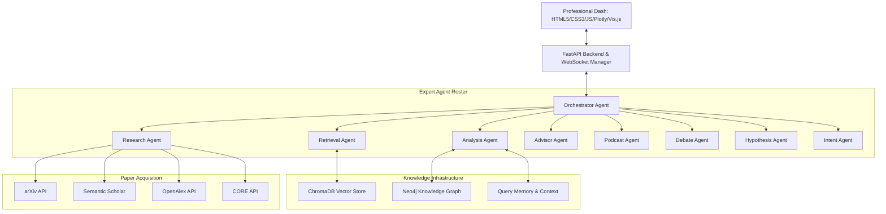

# 🔬 Agentic Research Matrix

An autonomous, multi-agent research ecosystem designed to accelerate academic discovery. The platform automates paper collection, deep semantic processing, RAG-based knowledge synthesis, and multi-perspective agentic analysis.

## 🏛️ System Architecture



## 🚀 Quick Start

### 1. Environment Setup
```bash
pip install -r requirements.txt
cp .env.example .env
# Configure LLM_PROVIDER (gemini, ollama, or openai)
```

### 2. Launch the System
```bash
python run_all.py
```
- **Web Interface**: [http://localhost:8000](http://localhost:8000)
- **API Documentation**: [http://localhost:8000/docs](http://localhost:8000/docs)

### 3. Docker Deployment
```bash
docker-compose up --build -d
```

## 🤖 Advanced Multi-Agent Roster

| Agent | Capability |
| :--- | :--- |
| **Orchestrator** | High-level task routing & agent coordination |
| **Research** | Targeted paper discovery across 4+ scientific APIs |
| **Retrieval** | Precision context extraction from the Vector Store |
| **Analysis** | Deep semantic insight generation & data synthesis |
| **Podcast** | Generates engaging audio summaries of complex research |
| **Debate** | Simulates adversarial peer review to stress-test findings |
| **Hypothesis** | Formulates novel research directions & testable claims |
| **Intent** | Classifies user queries for optimized agent routing |
| **Advisor** | Personalized research coaching & gap identification |
| **Style/Format** | Ensures all reports meet professional scholarly standards |

## 🌟 Key Features

- **Omnichannel Collection**: Seamlessly aggregate papers from arXiv, Semantic Scholar, OpenAlex, and CORE.
- **RAG + Knowledge Graph**: Hybrid retrieval combining vector embeddings with relational graph nodes for superior context.
- **Real-Time Telemetry**: WebSocket-driven dashboard updates for live agent status and search progress.
- **Research Audio (Podcasts)**: Convert paper abstracts and summaries into digestible audio briefs.
- **Trend Intelligence**: 3D PCA visualization of document embeddings and keyword cluster analysis.
- **Autonomous Workflows**: n8n integration for scheduled research monitoring and automatic report generation.

## 📂 Project Structure

```text
Agentic Research Matrix/
├── api/                       # FastAPI Engine & WebSocket Management
├── agents/                    # Full Suite of 17+ Specialist AI Agents
├── collectors/                # Paper Ingestion Clients (arXiv, OpenAlex, etc.)
├── processing/                # PDF Extraction & Semantic Chunking
├── rag/                       # Vector Database (ChromaDB) Orchestration
├── graph/                     # Neo4j Knowledge Graph Integration
├── analytics/                 # Trend Detection & Data Visualization
├── ui/                        # Modern Web Dashboard (Vanilla JS/CSS)
├── workflows/                 # n8n Automation Templates
└── memory/                    # Persistent Query Context & Session Memory
```

## 🛠️ Technology Stack

- **Backend**: Python 3.10+, FastAPI, Uvicorn
- **Intelligence**: Google Gemini (Recommended), Ollama (Local), OpenAI
- **Storage**: ChromaDB (Vector), Neo4j (Graph), SQLite (Memory)
- **Frontend**: HTML5, Vanilla JavaScript, Plotly.js, Vis.js, Lucide Icons
- **Automation**: n8n, Docker/Docker-Compose
- **Data Engineering**: LangChain, PyMuPDF, Scikit-learn (PCA/Clustering)

---
*Built with ❤️ for the research community.*
